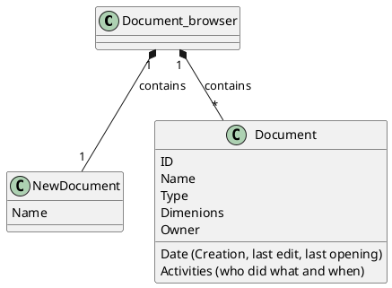

1 main window, 4 different main appearance

1) login form
2) register form
3) document browser
4) text editor
-5) (optional) some animation to show when loading

------------------------------------------------
1) LOGIN FORM
------------------------------------------------
------------------------------------------------
                    TOP
-Horizontal bar
  -Button resize
  -Button hide
  -Button close
------------------------------------------------
                   CENTER
-Form
  -InString id
  -InString password (not visible (?) ******* )
  -Button LogIn
  -label need to register?
  -Button SignUp
------------------------------------------------
                   BOTTOM

------------------------------------------------
actions (gui switch):

  +logIn()
  +signUp()
  -close()
  -hide()
   
reqs and checks:

    id: 8-20 char lenght alphanum
    id text area should not be empty
    id should exist
    pwd: 8-20 char lenght alphanum
    pwd should not be empty
    pwd should correspond to id
    
------------------------------------------------
3) DOCUMENT BROWSER
------------------------------------------------
------------------------------------------------

    
    
## Classi in comune

 Codice PlantUML 

@startuml
class mainWindow {
- _closeBtn: button
- _hideBtn: button
- _resizeBtn: button
}

class loginForm {
- _id: QLineEdit
- _pwd: QLineEdit
- _loginBtn: button
- _needToRegister: QLabel
- _signUpFormBtn: button
}

class signupForm {
- _id: QLineEdit
- _email: QLineEdit
- _confirmEmail: QLineEdit
- _pwd: QLineEdit
- _confirmPassword: QLineEdit
- _name: QLineEdit
- _surname: QLineEdit
- _ageYYYYMMDD: QCalendarWidget
- _sex: QRadioButton
- _signupBtn: button
- _loginFormBtn: button
- _alreadyRegistered: QLabel
}

