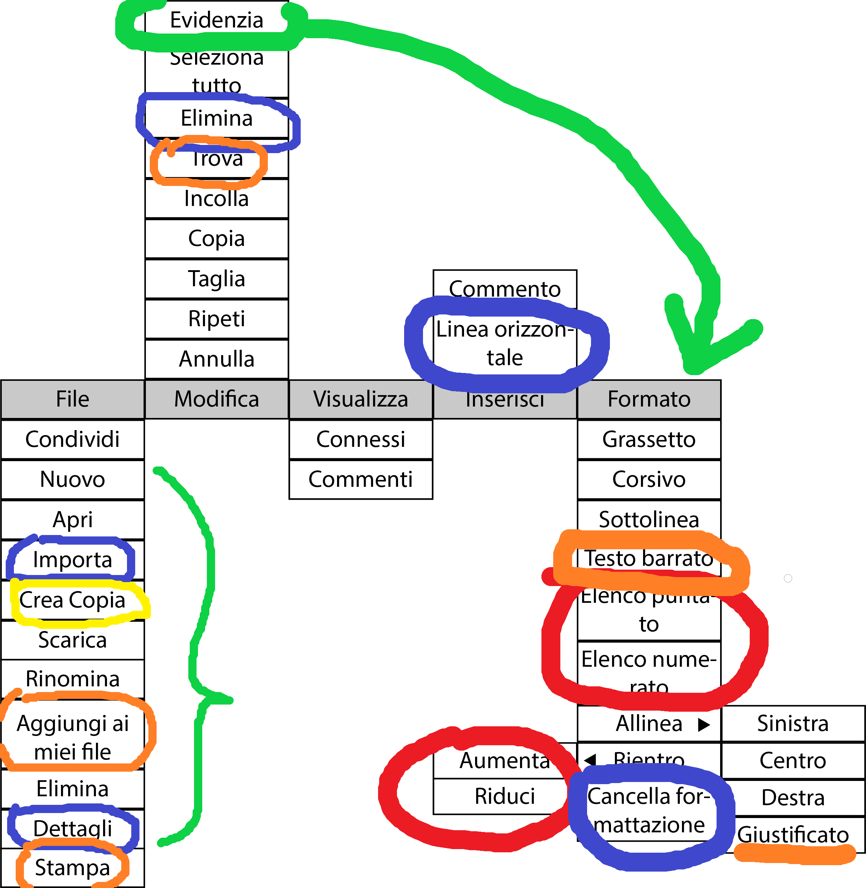

# Finestra di Login

# Form di registrazione

# Pannello di modifica utente

### Klajdi
>1. Implementata possibilità di cambiare foto utente.

# Browser dei documenti

### Klajdi
>1. Come mai devo togliere l'opzione "Scarica documento"? E' fattibile implementarla.
>2. Una possibile implementazione alternativa per il pulsante "+"?
>3. Voce "Ultimo accesso" cambiata con "Data creazione".

# Editor di testo

### Klajdi

>1. (Blu): tasti undo e redo.
>2. (Verde): Possibile alternativa per il pulsante "Condividi"?

# Tendine nell'editor di testo

### Klajdi
>1. (Blu): "Elimina" = elimina il documento in questione dalla lista documenti.
>2. (Blu):"Linea orizzontale" = linea di header che separa un testo da quello sotto.
>3. (Blu):"Importa" = permette di importare un documento da locale, sostituendolo con quello attuale.
>4. (Blu):"Dettagli" = Dettagli documento: data creazione, nome documento, con chi è condiviso, ecc...
>5. (Blu):"Cancella formattazione" = elimina lo stile grafico usato nel documento (font, grassetto, corsivo, ecc...).

<!--# Vista relazione finestre

<!--

<!--# Vista completa relazione finestre

<!--
